# StockBeacon Engineering Roadmap
*Building a Beginner-Friendly Stock Signal Platform*

## 📊 **CURRENT PROGRESS**
```
Phase 1: Foundation    ████████████████████ 100% ✅ COMPLETE
Phase 2: Data Engine   ████████████████████ 100% ✅ COMPLETE
Phase 3: Core Features ████████████████████ 100% ✅ COMPLETE
Phase 4: Advanced      ████████████████████ 100% ✅ COMPLETE
Phase 5: Testing       ░░░░░░░░░░░░░░░░░░░░ 0%   🔜 NEXT

Overall Progress: ████████████████░░░░ 80% Complete
```

### ✅ **Completed Milestones:**
- **Phase 1**: Foundation & Authentication ✅
- **Phase 2**: Data Engine & Score Algorithm ✅  
- **Phase 3**: All 5 Core UI Screens ✅
- **Phase 4**: AI Integration & Advanced Features ✅
  - AI-powered moat analysis with xAI (Grok)
  - SEC EDGAR integration for company data
  - Smart email system with Resend
  - Intelligent notification system
  - WebSocket real-time updates
  - Performance optimizations

### 🚀 **Completed Features:**
- **Authentication**: Supabase Auth with email/social login
- **Stock Engine**: Real-time quotes, financials, technical indicators
- **StockBeacon Score**: 0-100 scoring with business quality & timing
- **AI Moat Analysis**: 4-dimension competitive advantage scoring
- **Email System**: Beautiful templates, smart delivery, rate limiting
- **Notifications**: Multi-channel, activity-based, Perfect Storm alerts
- **Real-time**: WebSocket updates, user presence, live prices
- **All 5 Core Screens**: Dashboard, Screener, Stock Details, Watchlist, Portfolio

### 🔜 **Next Up:**
- **Phase 5**: Testing, Quality Assurance & Production Deployment

## 🎯 Project Overview
Build a 5-screen stock signal platform that simplifies investing for beginners through actionable recommendations, clear scoring, and confidence-building UX.

---

## 🏗️ **SYSTEM ARCHITECTURE OVERVIEW**

### **High-Level Architecture Diagram**


### **Navigation Flow Diagram**

```mermaid
graph TD
    A["🏠 Home/Dashboard<br/>- Top 3-5 signals<br/>- Portfolio summary<br/>- Watchlist widget (3-5 stocks)<br/>- Smart alerts<br/>- Quick actions"] --> B["📊 Stock Screener<br/>- 10 curated stocks<br/>- StockBeacon Scores<br/>- Filter by risk level"]
    
    A --> D["👁️ Watchlist<br/>- Smart alerts<br/>- Why I'm waiting<br/>- Buy triggers"]
    
    A --> E["💰 Portfolio<br/>- Position tracking<br/>- Health monitor<br/>- Exit signals"]
    
    B --> C["🔍 Stock Details<br/>- Investment health report<br/>- AI moat analysis<br/>- Should I buy? button"]
    
    C --> D
    C --> E
    C --> F["📧 Email Alert<br/>- Perfect storm notification<br/>- Bring user back to app"]
    
    D --> C
    D --> G["🔔 Push Notification<br/>- Buy signal triggered<br/>- Price near support"]
    
    E --> C
    E --> H["📱 Mobile Optimization<br/>- Thumb-friendly navigation<br/>- Swipe actions"]
    
    F --> A
    G --> A
    
    style A fill:#e1f5fe
    style B fill:#f3e5f5
    style C fill:#e8f5e8
    style D fill:#fff3e0
    style E fill:#fce4ec
```



### **StockBeacon Score Calculation Flow**

```mermaid
graph TD
    A["📊 Raw Stock Data Collection"] --> B["🔍 Data Validation & Cleaning"]
    B --> C["⚖️ Business Quality Analysis<br/>(60% weight)"]
    B --> D["⏰ Timing Opportunity Analysis<br/>(40% weight)"]
    
    C --> C1["💰 Financial Health<br/>(25 points max)<br/>• ROE: yahoo.roe >= 15% = full points<br/>• ROA: yahoo.roa >= 7% = full points<br/>• Debt: yahoo.totalDebt/netIncome < 3x"]
    
    C --> C2["🏰 AI Moat Analysis<br/>(20 points max)<br/>• OpenAI GPT-4 analysis<br/>• SEC 10-K filing data<br/>• Competitive comparison<br/>• Updated quarterly"]
    
    C --> C3["📈 Growth Consistency<br/>(15 points max)<br/>• Revenue growth: yahoo.revenueGrowth<br/>• Earnings growth: yahoo.earningsGrowth<br/>• Cash flow: yahoo.operatingCashflow<br/>• Consistency scoring (CV calculation)"]
    
    D --> D1["💲 Valuation Opportunity<br/>(20 points max)<br/>• DCF calculation vs current price<br/>• yahoo.regularMarketPrice<br/>• Target: 25%+ upside for full points"]
    
    D --> D2["📊 Technical Timing<br/>(20 points max)<br/>• Support level proximity<br/>• Trend direction analysis<br/>• Volume confirmation<br/>• Volatility penalty"]
    
    C1 --> E["🧮 Score Aggregation"]
    C2 --> E
    C3 --> E
    D1 --> E
    D2 --> E
    
    E --> F["🎯 Final StockBeacon Score<br/>(0-100)<br/>Math.round((businessQuality * 0.6) + (timing * 0.4))"]
    
    F --> G["🚦 Color Coding<br/>• Green: 70-100 (Strong Buy)<br/>• Yellow: 50-69 (Fair)<br/>• Red: 0-49 (Avoid)"]
    
    F --> H["📝 Plain English Explanation<br/>• AI-generated summary<br/>• Key strengths/weaknesses<br/>• Recommendation rationale"]
    
    G --> I["💾 Cache in Redis<br/>TTL: 1 hour during market<br/>TTL: 4 hours after close"]
    H --> I
    
    I --> J["📱 Display to User<br/>• Dashboard cards<br/>• Stock detail screens<br/>• Email notifications"]
```



## 🔌 **DETAILED DATA INTEGRATION SPECIFICATIONS**

### **Yahoo Finance API Integration**
```typescript
// Primary data source - yahoo-finance2 library
import yahooFinance from 'yahoo-finance2';

// Stock Price Data (Updated every 15 minutes)
const quote = await yahooFinance.quote('AAPL');
// Returns: regularMarketPrice, marketCap, trailingPE, forwardPE

// Financial Statements (Updated quarterly)
const financials = await yahooFinance.fundamentals('AAPL', {
  modules: ['incomeStatementHistory', 'balanceSheetHistory', 'cashflowStatementHistory']
});
// Returns: totalRevenue, netIncome, totalDebt, operatingCashflow

// Historical Data (For technical analysis)
const historical = await yahooFinance.historical('AAPL', {
  period1: '2023-01-01',
  period2: '2024-01-01',
  interval: '1d'
});
// Returns: open, high, low, close, volume for each day

// Key Metrics Extraction
const stockData = {
  roe: (financials.netIncome / financials.shareholderEquity) * 100,
  roa: (financials.netIncome / financials.totalAssets) * 100,
  debtToEarnings: financials.totalDebt / financials.netIncome,
  revenueGrowth: calculateGrowthRate(financials.totalRevenue, 5), // 5-year average
  priceToBook: quote.regularMarketPrice / financials.bookValuePerShare
};
```

### **OpenAI GPT-4 Integration (AI Moat Analysis)**
```typescript
import OpenAI from 'openai';

const openai = new OpenAI({ apiKey: process.env.OPENAI_API_KEY });

// Moat Analysis Function
async function analyzeMoat(symbol: string, companyData: any) {
  const prompt = `
    Analyze competitive moat for ${symbol}:
    
    Financial Metrics:
    - Gross Margin: ${companyData.grossMargin}%
    - Operating Margin: ${companyData.operatingMargin}%
    - Market Share: ${companyData.marketShare}%
    
    Business Description: ${companyData.businessSummary}
    
    Score 0-100 on: Brand Loyalty, Switching Costs, Network Effects, Scale Advantages
    Provide JSON response with scores and explanations.
  `;
  
  const response = await openai.chat.completions.create({
    model: "gpt-4",
    messages: [{ role: "user", content: prompt }],
    temperature: 0.3, // Lower for consistent analysis
    max_tokens: 1000
  });
  
  return JSON.parse(response.choices[0].message.content);
}
```

### **SEC EDGAR API Integration**
```typescript
// For 10-K/10-Q filings
const SEC_BASE_URL = 'https://data.sec.gov/api/xbrl/companyfacts';

async function getCompanyFilings(symbol: string) {
  const cik = await getCIKFromSymbol(symbol); // Convert symbol to CIK
  const response = await fetch(`${SEC_BASE_URL}/CIK${cik}.json`, {
    headers: {
      'User-Agent': 'StockBeacon/1.0 (contact@stockbeacon.app)' // Required by SEC
    }
  });
  
  const data = await response.json();
  
  // Extract key business metrics
  return {
    businessDescription: data.facts['dei']['EntityBusinessDescription'],
    employees: data.facts['dei']['EntityCommonStockSharesOutstanding'],
    risks: extractRiskFactors(data) // Custom function to parse risk factors
  };
}
```

## ⚡ **REAL-TIME DATA CHANGE HANDLING**

### **Data Update Pipeline**

```mermaid
graph TD
    A["🕐 Cron Job Scheduler<br/>Bull Queue"] --> B["📊 Data Fetcher<br/>Every 15 min (market hours)"]
    
    B --> C["🔍 Change Detection<br/>Compare with cached values"]
    
    C --> D{Score Change<br/>> 5 points?}
    
    D -->|Yes| E["🚨 Trigger Alert System<br/>High priority notification"]
    D -->|No| F["💾 Update Cache<br/>Redis TTL: 1 hour"]
    
    E --> G["👥 Find Affected Users<br/>Query watchlists & portfolios"]
    
    G --> H{User Active<br/>in last 30 min?}
    
    H -->|Yes| I["🔔 WebSocket Push<br/>Real-time UI update"]
    H -->|No| J["📧 Queue Email<br/>Priority-based timing"]
    
    I --> K["📱 UI State Update<br/>Optimistic updates"]
    J --> L["✉️ Send Email<br/>Resend/SendGrid"]
    
    F --> M["📊 Background Jobs<br/>• Score recalculation<br/>• Technical analysis<br/>• Support/resistance update"]
    
    M --> N["💽 Database Update<br/>Batch write to Supabase"]
    
    N --> O["🔄 Real-time Sync<br/>Supabase subscriptions"]
    
    O --> P["🖥️ All Connected Clients<br/>Auto-refresh data"]
    
    style E fill:#ffebee
    style I fill:#e8f5e8
    style J fill:#fff3e0
    style L fill:#e3f2fd
```



**Key Concepts:**

1. **Scheduled Data Collection**: Every 15 minutes during market hours, background jobs fetch fresh stock data from Yahoo Finance
2. **Change Detection**: Compare new data with cached values to identify significant changes (>5 point score changes trigger alerts)
3. **Smart Notification Logic**: Active users get instant WebSocket updates, inactive users get priority-based emails
4. **Optimistic UI Updates**: Frontend shows changes immediately while background processes confirm accuracy
5. **Batch Processing**: Database updates happen in batches to minimize load and improve performance

## 📱 **DETAILED SCREEN SPECIFICATIONS**

### **Screen 1: Home/Dashboard**
**Purpose**: Quick overview and immediate actions
**Key Features**:
- **Top 3-5 Stock Signals**: Curated list with scores 70+ only
- **Portfolio Health Summary**: One-line status (e.g., "2 stocks need attention")
- **Watchlist Widget**: Top 3-5 watched stocks with status indicators (Ready/Almost/Waiting)
- **Smart Alerts Section**: Recent Perfect Storm alerts and price target hits
- **Quick Action Buttons**: "Find New Stocks", "Check Full Watchlist", "Review Portfolio"
- **Today's Market Mood**: Simple indicator (bullish/bearish/neutral)

**Data Sources**:
- Real-time: Current stock prices via Yahoo Finance
- Cached: StockBeacon Scores (updated hourly)
- User-specific: Portfolio and watchlist data from Supabase
- Watchlist triggers: Real-time monitoring for buy criteria alignment

### **Screen 2: Stock Screener**
**Purpose**: Discover new investment opportunities
**Key Features**:
- **Maximum 10 Stocks**: Quality over quantity approach
- **StockBeacon Score Display**: Large, color-coded numbers (Green/Yellow/Red)
- **"Why Now?" Explanations**: 1-2 sentence summaries for each stock
- **Risk Level Filter**: Conservative/Balanced/Growth categories
- **"Perfect Storm" Indicators**: Special badge when all criteria align

**Data Processing**:
- Background job runs every hour to identify top candidates
- AI moat analysis cached and updated quarterly
- Technical analysis updated daily after market close
- Fundamental data refreshed when earnings are released

### **Screen 3: Stock Details (Investment Health Report)**
**Purpose**: Deep analysis before buying decision
**Key Features**:
- **Investment Health Report**: Visual checklist with traffic light colors
- **AI Moat Explanation**: Plain English summary of competitive advantages
- **"Should I Buy?" Decision Engine**: Clear recommendation with reasoning
- **Price Chart with Support Levels**: Simple chart showing key technical levels
- **Market Sentiment Radar**: News impact summary with emoji indicators

**Intelligence Layer**:
- Combines fundamental metrics, AI moat analysis, and technical timing
- Updates recommendation in real-time as conditions change
- Provides confidence level for each recommendation
- Shows historical success rate of similar signals

### **Screen 4: Watchlist (Smart Monitoring)**
**Purpose**: Monitor stocks waiting for perfect timing
**Key Features**:
- **"Why I'm Waiting" Progress Bars**: Visual indication of what's needed for buy signal
- **Smart Alert Configuration**: Context-aware notifications
- **Buy Trigger Countdown**: Shows proximity to ideal entry points
- **"Perfect Storm" Notifications**: When all criteria suddenly align

**Monitoring Logic**:
- Tracks multiple conditions simultaneously (price, trend, valuation)
- Sends contextual alerts explaining why stock became actionable
- Prevents alert fatigue through intelligent throttling
- Learns from user behavior to optimize timing

### **Screen 5: Portfolio (Risk Management)**
**Purpose**: Manage existing positions and risk
**Key Features**:
- **Portfolio Health Monitor**: Overall risk assessment
- **Position Cards**: Show current score vs. purchase score for each holding
- **Exit Radar**: Early warning system for deteriorating positions
- **Monthly Report Card**: Performance summary with lessons learned
- **Rebalancing Suggestions**: AI recommendations for portfolio optimization

**Risk Intelligence**:
- Tracks how each position's fundamentals have changed since purchase
- Alerts when business quality deteriorates or better opportunities arise
- Provides clear exit signals with reasoning
- Shows opportunity cost of current holdings vs. new opportunities

## 🔄 **CHANGE HANDLING STRATEGY**

### **Real-Time vs. Batch Updates**

**Real-Time Updates (WebSocket)**:
- Stock price changes
- Alert notifications
- User activity status
- Portfolio value changes

**Hourly Batch Updates**:
  - StockBeacon Score recalculations
- Technical indicator updates
- Support/resistance level adjustments
- Alert condition checks

**Daily Batch Updates**:
- Historical data collection
- Trend analysis updates
- Volume analysis
- Chart pattern recognition

**Quarterly Updates**:
- AI moat analysis refresh
- Fundamental metric updates
- Competitive landscape assessment
- Long-term trend analysis

### **User Experience During Updates**

**Optimistic Updates**: Show changes immediately in UI while confirming in background
**Graceful Degradation**: If real-time fails, fall back to cached data with timestamps
**Loading States**: Clear indicators when fresh data is being fetched
**Error Handling**: Friendly messages when data services are temporarily unavailable

## 🎯 **PERFORMANCE & SCALABILITY STRATEGY**

### **Caching Strategy**
- **Redis Cache**: Hot data (prices, scores) with 15-minute TTL during market hours
- **CDN Caching**: Static assets and historical charts
- **Browser Caching**: User preferences and navigation state
- **Database Indexing**: Optimized queries for real-time lookups

### **Load Distribution**
- **Background Jobs**: Heavy calculations run outside user request cycle
- **API Rate Limiting**: Prevent external API abuse and cost overruns
- **Database Connection Pooling**: Efficient connection management
- **Horizontal Scaling**: Stateless design allows easy server scaling

### **Cost Optimization**
- **Batch API Calls**: Group multiple stock requests to reduce costs
- **Intelligent Caching**: Longer cache for less volatile data
- **Tiered Data Access**: Premium features for real-time data
- **Usage Monitoring**: Track and optimize expensive operations

## 📋 Phase-by-Phase Development Plan

---

## **PHASE 1: Foundation & Core Infrastructure (Week 1-2)**

### **Sprint 1.1: Project Setup & Base Architecture** ✅ COMPLETE
**Duration**: 3-4 days
**Status**: ✅ 100% Complete - All tasks finished successfully!

#### **Tasks:**
1. **Project Initialization**
   - [x] Initialize Next.js 14 project with TypeScript ✅
   - [x] Configure Tailwind CSS and shadcn/ui ✅
   - [x] Set up ESLint, Prettier, Husky pre-commit hooks ✅
   - [x] Create basic folder structure (`/components`, `/lib`, `/app`, `/types`) ✅

2. **Database Setup**
   - [x] Design database schema (Users, Stocks, Watchlists, Portfolios, StockData) ✅
   - [x] Set up Supabase project and PostgreSQL instance ✅
   - [x] Configure Supabase client and environment variables ✅
   - [x] Set up Prisma with Supabase PostgreSQL ✅
   - [x] Create initial migrations and Row Level Security (RLS) policies ✅
   - [x] Set up Redis for caching (Upstash Redis) ✅

3. **API Integration Setup**
   - [x] Install and configure yahoo-finance2 ✅
   - [ ] Install and configure finnhub client (Optional - Yahoo Finance sufficient)
   - [x] Create API service layer (`/lib/services/`) ✅
   - [x] Implement rate limiting and error handling ✅

**Deliverables**: 
- Working Next.js app with database connectivity
- Basic API data fetching capability
- Development environment ready

---

### **Sprint 1.2: Authentication & User Management** ✅ COMPLETE
**Duration**: 2-3 days
**Status**: ✅ 100% Complete - Full authentication system implemented!

#### **Tasks:**
1. **Authentication System**
   - [x] Set up Supabase Auth (built-in authentication) ✅
   - [x] Configure email/password and social providers (Google, GitHub) ✅
   - [x] Create login/register pages with Supabase Auth UI ✅
   - [x] Set up session management with Supabase client ✅
   - [x] Create protected route middleware using Supabase auth ✅

2. **User Profile Setup**
   - [x] User model with preferences ✅
   - [x] Basic profile management ✅
   - [x] Risk tolerance settings (Conservative/Balanced/Growth) ✅

**Deliverables**: 
- Working authentication system
- User can register, login, and set preferences

---

## **PHASE 2: Stock Data Engine (Week 3-4)** ✅ COMPLETE

### **Sprint 2.1: Data Collection & Processing** ✅ COMPLETE
**Duration**: 4-5 days
**Status**: ✅ 100% Complete

#### **Tasks:**
1. **Stock Data Models**
   - [x] Create comprehensive stock data schema ✅
   - [x] Implement StockBeacon Score calculation algorithm ✅
   - [x] Create financial metrics calculation functions ✅
   - [x] Set up data validation and sanitization ✅

2. **Real-time Data Pipeline**
   - [x] Background job system for data fetching ✅
   - [x] Implement caching strategy (Redis) ✅
   - [x] Create data update scheduler ✅
   - [x] Error handling and fallback mechanisms ✅

3. **Core Business Logic**
   - [x] Fundamental analysis scoring system ✅
   - [x] Technical analysis indicators ✅
   - [ ] AI-powered moat strength assessment system (Coming in Phase 4)
   - [x] Buy/sell signal generation logic ✅

**Deliverables**: 
- Robust data collection system ✅
- StockBeacon Score calculation working ✅
- Background data updates functioning ✅

---

### **Sprint 2.2: Stock Screener Logic** ✅ COMPLETE
**Duration**: 3-4 days
**Status**: ✅ 100% Complete

#### **Tasks:**
1. **Screening Algorithm**
   - [x] Implement filtering criteria (ROE, ROA, debt ratios, etc.) ✅
   - [x] Create "Great Business" identification logic ✅
   - [x] Implement timing algorithms (support levels, trends) ✅
   - [x] Quality scoring and ranking system ✅

2. **Curated Stock Selection**
   - [x] Algorithm to select top 10 stocks ✅
   - [x] "Why Now?" explanation generator ✅
   - [x] Risk categorization system ✅
   - [x] Performance tracking for recommendations ✅

**Deliverables**: 
- Working stock screener with quality recommendations ✅
- Curated list of 10 best stocks updated daily ✅

---

## **PHASE 3: Core UI Screens (Week 5-7)**

### **Sprint 3.1: Home/Dashboard Screen**
**Duration**: 3-4 days

#### **Tasks:**
1. **Dashboard Layout**
   - [ ] Create responsive dashboard layout
   - [ ] Implement StockBeacon Score components
   - [ ] Add portfolio health summary widget
   - [ ] Create watchlist widget with status indicators
   - [ ] Add smart alerts section
   - [ ] Create action buttons and navigation

2. **Watchlist Widget Integration**
   - [ ] Display top 3-5 watched stocks
   - [ ] Implement status indicators (Ready/Almost/Waiting)
   - [ ] Add "Perfect Storm" alert badges
   - [ ] Create quick "Why waiting?" tooltips
   - [ ] Link to full watchlist view

3. **Real-time Updates**
   - [ ] WebSocket connection for live updates
   - [ ] Real-time score updates
   - [ ] Watchlist trigger monitoring
   - [ ] Push notification setup
   - [ ] Loading states and error handling

**Components to Build**:
- `DashboardLayout`
- `StockBeaconCard`
- `PortfolioSummary`
- `WatchlistWidget`
  - `WatchlistMiniCard`
  - `StatusIndicator`
  - `PerfectStormBadge`
- `SmartAlertsSection`
- `QuickActions`
- `MarketMoodIndicator`

---

### **Sprint 3.2: Stock Screener Screen**
**Duration**: 4-5 days

#### **Tasks:**
1. **Screener Interface**
   - [ ] Stock list with StockBeacon Scores
   - [ ] Color-coded scoring system (Green/Yellow/Red)
   - [ ] "Why Now?" explanations
   - [ ] Filter controls (risk level, sectors)

2. **User Interaction**
   - [ ] Add to watchlist functionality
   - [ ] Quick view stock details
   - [ ] Sorting and filtering
   - [ ] Pagination or infinite scroll

**Components to Build**:
- `StockScreener`
- `StockCard`
- `ScoreIndicator`
- `FilterControls`
- `WhyNowExplanation`

---

### **Sprint 3.3: Stock Details Screen**
**Duration**: 4-5 days

#### **Tasks:**
1. **Investment Health Report**
   - [ ] Visual health indicators (✅❌⚠️)
   - [ ] Fundamental checklist with explanations
   - [ ] Score breakdown visualization
   - [ ] Plain English explanations

2. **Advanced Features**
   - [ ] Price chart with support levels
   - [ ] Market sentiment radar (news analysis)
   - [ ] "Should I Buy?" decision engine
   - [ ] Share and watchlist buttons

**Components to Build**:
- `InvestmentHealthReport`
- `FundamentalChecklist`
- `PriceChart`
- `SentimentRadar`
- `BuyDecisionButton`

---

### **Sprint 3.4: Watchlist Screen**
**Duration**: 3-4 days

#### **Tasks:**
1. **Smart Watchlist**
   - [ ] Watchlist management interface
   - [ ] "Why I'm Waiting" progress indicators
   - [ ] Smart alert configuration
   - [ ] Buy trigger countdown

2. **Alert System**
   - [ ] Context-aware alert engine
   - [ ] "Perfect Storm" detection
   - [ ] Push notification triggers
   - [ ] Alert history and management

**Components to Build**:
- `WatchlistManager`
- `WaitingExplanation`
- `ProgressIndicator`
- `SmartAlerts`
- `TriggerCountdown`

---

### **Sprint 3.5: Portfolio Screen**
**Duration**: 4-5 days

#### **Tasks:**
1. **Portfolio Management**
   - [ ] Position tracking and management
   - [ ] Performance visualization
   - [ ] Buy power calculator
   - [ ] Position cards with score comparison

2. **Risk Monitoring**
   - [ ] Portfolio health monitor
   - [ ] Exit radar system
   - [ ] Risk alerts and warnings
   - [ ] Monthly report card generator

**Components to Build**:
- `PortfolioManager`
- `PositionCard`
- `HealthMonitor`
- `ExitRadar`
- `ReportCard`

---

## **PHASE 4: AI Features & Advanced Functionality (Week 8-10)**

### **Sprint 4.1: AI-Powered Moat Analysis**
**Duration**: 4-5 days

#### **Tasks:**
1. **AI Service Integration**
   - [ ] Set up OpenAI GPT-4 API integration
   - [ ] Create SEC EDGAR API client for 10-K/10-Q filings
   - [ ] Build document parsing and summarization system
   - [ ] Implement AI prompt engineering for moat analysis

2. **Moat Analysis Engine**
   - [ ] Create AI moat scoring system (0-100 points)
   - [ ] Implement 4-dimension analysis (Brand, Switching Costs, Network Effects, Scale)
   - [ ] Build competitive comparison logic
   - [ ] Create plain English explanation generator

3. **Data Pipeline for AI**
   - [ ] Quarterly moat analysis scheduler
   - [ ] Caching system for AI results
   - [ ] Fallback to manual scoring system
   - [ ] Cost monitoring and batch processing

**Deliverables**:
- Working AI moat analysis system
      - Integration with StockBeacon Score algorithm
- Beginner-friendly moat explanations

---

### **Sprint 4.2: Smart Notifications & Email System**
**Duration**: 4-5 days

#### **Tasks:**
1. **Multi-Channel Notification System**
   - [ ] Real-time WebSocket notifications (for active users)
   - [ ] Browser push notifications
   - [ ] Email notification system with templates
   - [ ] SMS notifications (future premium feature)
   - [ ] Notification preferences per channel

2. **User Activity Tracking**
   - [ ] Track user online/offline status
   - [ ] Last active timestamp tracking
   - [ ] Session duration monitoring
   - [ ] Engagement scoring system

3. **Smart Email Delivery Logic**
   - [ ] Send emails only if user inactive for X minutes
   - [ ] Email frequency limits (max per day/week)
   - [ ] Priority-based email system (urgent vs. regular alerts)
   - [ ] Email open/click tracking for optimization

4. **Email Templates & Design**
   - [ ] Beautiful responsive email templates
   - [ ] StockBeacon Score visualization in emails
   - [ ] Plain text fallbacks for all emails
   - [ ] Personalized email content based on user preferences

5. **Alert Intelligence**
   - [ ] Context-aware alert generation
   - [ ] Smart timing (market hours only)
   - [ ] Alert effectiveness tracking
   - [ ] Prevent notification spam with intelligent throttling

---

### **Sprint 4.3: Performance & Optimization**
**Duration**: 3-4 days

#### **Tasks:**
1. **Performance Optimization**
   - [ ] Code splitting and lazy loading
   - [ ] Image optimization
   - [ ] Database query optimization
   - [ ] Caching strategy refinement

2. **Mobile Optimization**
   - [ ] Responsive design improvements
   - [ ] Touch interactions
   - [ ] Mobile-specific UX optimizations
   - [ ] Progressive Web App features

---

## **PHASE 5: Testing & Deployment (Week 10)**

### **Sprint 5.1: Testing & Quality Assurance**
**Duration**: 3-4 days

#### **Tasks:**
1. **Testing Suite**
   - [ ] Unit tests for core business logic
   - [ ] Integration tests for API endpoints
   - [ ] E2E tests for critical user flows
   - [ ] Performance testing

2. **Quality Assurance**
   - [ ] Cross-browser testing
   - [ ] Mobile device testing
   - [ ] Accessibility testing
   - [ ] Security audit

---

### **Sprint 5.2: Production Deployment**
**Duration**: 2-3 days

#### **Tasks:**
1. **Deployment Setup**
   - [ ] Production environment configuration
   - [ ] Database migration to production
   - [ ] Environment variables setup
   - [ ] Monitoring and logging setup

2. **Go-Live Preparation**
   - [ ] Final testing in production environment
   - [ ] Performance monitoring setup
   - [ ] Error tracking configuration
   - [ ] Backup and recovery procedures

---

## 🔧 **Technical Specifications**

### **Key Libraries & Dependencies**
```json
{
  "dependencies": {
    "next": "^14.0.0",
    "react": "^18.0.0",
    "typescript": "^5.0.0",
    "@supabase/supabase-js": "^2.38.0",
    "@supabase/auth-ui-react": "^0.4.6",
    "@supabase/auth-ui-shared": "^0.1.8",
    "@prisma/client": "^5.0.0",
    "prisma": "^5.0.0",
    "yahoo-finance2": "^2.0.0",
    "openai": "^4.0.0",
    "@sendgrid/mail": "^7.7.0",
    "resend": "^2.0.0",
    "react-email": "^1.10.0",
    "zustand": "^4.0.0",
    "framer-motion": "^10.0.0",
    "recharts": "^2.8.0",
    "lightweight-charts": "^4.0.0",
    "react-hot-toast": "^2.4.0",
    "socket.io-client": "^4.7.0",
    "@radix-ui/react-*": "latest",
    "tailwindcss": "^3.3.0",
    "lucide-react": "^0.290.0",
    "bull": "^4.10.0",
    "redis": "^4.6.0",
    "date-fns": "^2.30.0"
  }
}
```

### **Database Schema Overview (Supabase PostgreSQL)**


**Key Database Features:**
- **Row Level Security (RLS)**: Users can only access their own watchlists, portfolios, and preferences
- **Real-time Subscriptions**: Supabase provides live updates when data changes
- **Built-in Auth**: User management handled automatically by Supabase
- **JSON Storage**: Flexible storage for preferences, score components, and AI analysis
- **Optimized Indexes**: Fast queries on symbol, user_id, and timestamp fields

-- Supabase Features Used:
-- - Built-in Auth (users table managed automatically)
-- - Row Level Security for data isolation
-- - Real-time subscriptions for live updates
-- - Edge Functions for serverless compute
```

### **Supabase Architecture Benefits**
```
🔐 Built-in Authentication
├── Email/password + social providers (Google, GitHub)
├── JWT tokens and session management
└── User profiles and preferences

🛡️ Row Level Security (RLS)
├── Users can only access their own data
├── Database-level security (not just app-level)
└── Automatic data isolation

⚡ Real-time Features
├── Live portfolio updates
├── Instant alert notifications
└── Real-time stock score changes

🚀 Edge Functions
├── Serverless background jobs
├── Stock data processing
└── Signal calculation

💾 Built-in Storage (for future features)
├── User avatars
├── Document uploads
└── Chart screenshots
```

### **API Endpoints Structure**
```
Supabase Client - Direct database queries with RLS
/api/stocks/* - Stock data and screening (Next.js API)
/api/external/* - Yahoo Finance integration
/api/signals/* - StockBeacon scoring
/api/alerts/* - Push notification system
```

## 📊 **Success Metrics**
- **User Engagement**: Time spent on platform, screens per session
- **Signal Accuracy**: Track buy/sell signal performance
- **User Confidence**: Survey scores, feature usage patterns
- **Platform Performance**: Page load times, uptime, error rates

## 🚀 **Launch Strategy**
1. **Beta Testing** (Week 11): Limited user group
2. **Feedback Integration** (Week 12): Implement user feedback
3. **Public Launch** (Week 13): Marketing and user acquisition
4. **Iteration** (Ongoing): Continuous improvement based on data

---

**Total Estimated Timeline**: 10-13 weeks for MVP
**Team Size**: 2-3 developers (1 senior, 1-2 mid-level)
**Key Success Factor**: Focus on user experience and signal accuracy over feature quantity