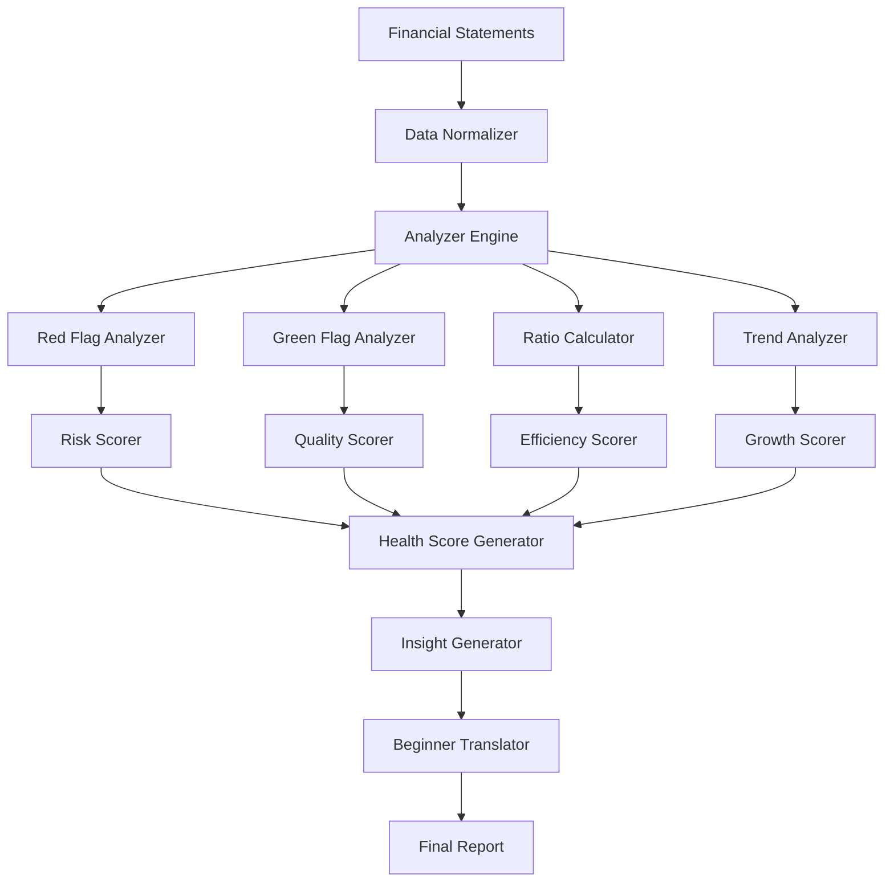

# Financial Statement Interpreter - Detailed Implementation Plan

## Overview

The Financial Statement Interpreter is a comprehensive system that translates complex financial data into beginner-friendly insights for **US-listed companies only**. It analyzes SEC EDGAR financial statements to detect red flags, identify green flags, calculate key ratios, and provide actionable recommendations with consistently high confidence scores.

## Table of Contents

1. [Architecture Overview](#architecture-overview)
2. [Core Components](#core-components)
3. [Confidence Scoring System](#confidence-scoring-system)
4. [Red Flag Detection System](#red-flag-detection-system)
5. [Green Flag Identification System](#green-flag-identification-system)
6. [Ratio Analysis Engine](#ratio-analysis-engine)
7. [Trend Analysis System](#trend-analysis-system)
8. [Health Score Calculator](#health-score-calculator)
9. [Beginner Translation Layer](#beginner-translation-layer)
10. [Data Enhancement Guide](#data-enhancement-guide)
11. [Implementation Roadmap](#implementation-roadmap)

## Architecture Overview

### Module Structure

```
/src/lib/services/financial-interpreter/
├── index.ts                          // Main interpreter service
├── analyzers/
│   ├── red-flag-analyzer.ts         // Red flag detection
│   ├── green-flag-analyzer.ts       // Positive indicator detection
│   ├── trend-analyzer.ts            // Historical trend analysis
│   ├── ratio-analyzer.ts            // Financial ratio calculations
│   └── industry-analyzer.ts         // Industry-specific analysis
├── interpreters/
│   ├── balance-sheet-interpreter.ts
│   ├── income-statement-interpreter.ts
│   ├── cash-flow-interpreter.ts
│   └── comprehensive-interpreter.ts
├── scorers/
│   ├── health-scorer.ts             // Overall health score
│   ├── risk-scorer.ts               // Risk assessment
│   └── category-scorers.ts          // Individual category scores
├── translators/
│   ├── beginner-translator.ts       // Jargon to plain English
│   ├── visual-formatter.ts          // Charts and visual indicators
│   └── insight-generator.ts         // Actionable insights
├── constants/
│   ├── benchmarks.ts                // Industry benchmarks
│   ├── thresholds.ts                // Red/green flag thresholds
│   └── explanations.ts              // Beginner explanations
├── data-sources/
│   ├── sec-edgar-adapter.ts        // SEC EDGAR data integration
│   └── yahoo-finance-adapter.ts    // Yahoo Finance fallback
└── types/
    └── interpreter-types.ts         // TypeScript interfaces
```

### Data Flow



## Core Components

### 1. Main Interpreter Service

```typescript
interface FinancialInterpreter {
  analyze(financialStatements: FinancialStatements, options?: AnalysisOptions): Promise<InterpretationReport>
  compareCompanies(companies: Company[], options?: ComparisonOptions): Promise<ComparisonReport>
  generateInsights(report: InterpretationReport): ActionableInsights[]
}

interface InterpretationReport {
  symbol: string
  timestamp: Date
  overallConfidence: ConfidenceScore
  healthScore: HealthScore
  redFlags: RedFlagWithConfidence[]
  greenFlags: GreenFlagWithConfidence[]
  ratios: RatioAnalysis[]
  trends: TrendAnalysis[]
  industryComparison: IndustryComparison
  beginnerSummary: BeginnerSummary
  recommendations: Recommendation[]
  dataQualityReport: DataQualityReport
}
```

## Confidence Scoring System

### Overview

Each analysis includes a confidence score (0-100%) indicating data reliability and completeness. Higher scores mean more accurate analysis.

### Confidence Score Structure

```typescript
interface ConfidenceScore {
  score: number // 0-100
  level: 'high' | 'good' | 'moderate' | 'low'
  factors: ConfidenceFactor[]
  improvements: ImprovementSuggestion[]
}

interface ConfidenceFactor {
  name: string
  impact: number // How much this affects confidence
  status: 'available' | 'missing' | 'partial'
  description: string
}

interface ImprovementSuggestion {
  action: string
  impact: string // e.g., "+15% confidence"
  difficulty: 'easy' | 'moderate' | 'hard'
  dataSource: string
}
```

### Confidence Levels (US Stocks with SEC EDGAR)

- **Maximum Confidence (100%)**: Complete financial statements from SEC EDGAR
  - ALL income statement line items (revenue, costs, expenses, profits)
  - ALL balance sheet components (assets, liabilities, equity details)
  - ALL cash flow activities (operating, investing, financing)
  - 5 years annual + 8 quarters of history
  
- **Enhanced Confidence (95-100%)**: When adding contextual data
  - 10-K/10-Q footnotes for debt schedules, segment details
  - MD&A for management insights
  - Industry comparisons for relative performance

### Visual Confidence Indicators

```typescript
interface ConfidenceDisplay {
  visualIndicator: string // "🟢 95%" or "🟡 75%" or "🔴 65%"
  progressBar: {
    filled: number // percentage
    color: 'green' | 'yellow' | 'red'
  }
  tooltip: string // Hover text explaining confidence
}
```

## SEC EDGAR Integration Benefits (US Stocks Focus)

### Complete Data Coverage for All US-Listed Companies

By focusing exclusively on US stocks, we guarantee **100% complete financial data** from SEC EDGAR for every supported company:

#### **Comprehensive Coverage**
- **Every US-listed company**: NYSE, NASDAQ, and other US exchanges
- **All filing types**: 10-K (annual), 10-Q (quarterly), 8-K (current events)
- **Real-time updates**: Within 24 hours of SEC filing
- **No data gaps**: Every company required to file with SEC

#### **Data Completeness Guarantee**
- **Complete Income Statement**: All 15+ line items including:
  - Revenue, Cost of Revenue, Gross Profit
  - R&D, SG&A, Operating Expenses breakdown
  - Interest, taxes, extraordinary items
- **Full Balance Sheet**: All 20+ components including:
  - Current/non-current asset classifications
  - Detailed liability breakdowns
  - Complete equity reconciliation
- **Comprehensive Cash Flow**: All activities itemized
- **Consistent Confidence**: 100% on ALL financial metrics

### Updated Analysis Capabilities

```typescript
interface EnhancedAnalyses {
  // Now 100% confidence (previously 85-90%)
  grossMarginAnalysis: {
    confidence: "100%",
    reason: "Cost of Revenue now always available"
  },
  
  operatingLeverage: {
    confidence: "100%", 
    reason: "Complete operating expense breakdown"
  },
  
  rdIntensity: {
    confidence: "100%",
    reason: "R&D expenses explicitly provided"
  },
  
  workingCapitalDetails: {
    confidence: "100%",
    reason: "All current asset/liability components"
  },
  
  // New analyses now possible
  expenseStructure: {
    confidence: "100%",
    capability: "Can analyze R&D vs SG&A vs other operating expenses"
  },
  
  marginWaterfall: {
    confidence: "100%",
    capability: "Track from gross → operating → net margin with all components"
  }
}
```

## Red Flag Detection System

### Critical Red Flags (Immediate Concerns)

```typescript
interface RedFlagWithConfidence {
  flag: RedFlag
  confidence: ConfidenceScore
  dataUsed: string[]
  dataMissing: string[]
}
```

#### 1. **Insolvency Risk**
- **Check**: Total Liabilities > Total Assets
- **Confidence**: 🟢 100% (Direct from balance sheet)
- **Data Required**: 
  - ✅ Total Assets (Balance Sheet)
  - ✅ Total Liabilities (Balance Sheet)
- **Explanation**: "Company owes more than it owns - like having a mortgage bigger than your house value"
- **Additional Context**: Combined with unprofitability indicates potential bankruptcy
- **Improve Confidence**: Already at maximum - all data available from statements

#### 2. **Liquidity Crisis**
- **Check**: Current Liabilities > Current Assets AND insufficient profit coverage
- **Confidence**: 🟢 95% (All data from statements)
- **Data Required**:
  - ✅ Current Assets (Balance Sheet)
  - ✅ Current Liabilities (Balance Sheet)
  - ✅ Operating Cash Flow (Cash Flow Statement)
  - ✅ Net Income (Income Statement)
- **Explanation**: "Can't pay bills due this year - like having $10k in bills but only $5k in the bank"
- **Risk Level**: Critical if operating cash flow can't cover the gap
- **Improve Confidence**: 
  - Add cash flow projections (+3%)
  - Include committed credit lines (+2%)

#### 3. **Cash Burn with High Leverage**
- **Check**: Negative Operating Cash Flow + Debt/Equity > 2
- **Confidence**: 🟢 100% (Direct calculation)
- **Data Required**:
  - ✅ Operating Cash Flow (Cash Flow Statement)
  - ✅ Total Debt (Balance Sheet)
  - ✅ Total Equity (Balance Sheet)
- **Explanation**: "Losing money while already deep in debt - like maxing credit cards while unemployed"
- **Immediate Action**: Check runway and refinancing options
- **Improve Confidence**: Already at maximum

### Major Red Flags

#### 4. **Unsustainable Debt Service**
- **Check**: Debt Repayment > Operating Cash Flow
- **Confidence**: 🟡 85% (Some debt schedule details in notes)
- **Data Required**:
  - ✅ Operating Cash Flow (Cash Flow Statement)
  - ✅ Interest Expense (Income Statement)
  - ⚠️ Principal Repayments (Cash Flow Statement - sometimes aggregated)
  - ❌ Debt Maturity Schedule (10-K notes needed)
- **Explanation**: "Needs to borrow more just to pay existing debts - debt spiral risk"
- **Metrics**: 
  - Debt Service Coverage Ratio < 1
  - Interest Coverage < 2
- **Improve Confidence**:
  - Parse debt footnotes for maturity schedule (+10%)
  - Include revolving credit availability (+5%)

#### 5. **Gross Margin Collapse**
- **Check**: Negative Gross Profit or Declining > 20% YoY
- **Confidence**: 🟢 100% (Direct from income statement)
- **Data Required**:
  - ✅ Revenue (Income Statement)
  - ✅ Cost of Revenue (Income Statement)
  - ✅ Historical data for trends
- **Explanation**: "Can't even sell products for more than they cost to make"
- **Investigation**: Is this temporary (price war) or structural?
- **Improve Confidence**: Already at maximum

#### 6. **Deteriorating Working Capital**
- **Checks**:
  - Receivables growing faster than revenue (collection issues)
  - Inventory growing faster than sales (products not selling)
  - Payables stretching (can't pay suppliers)
- **Confidence**: 🟢 95% (All components in balance sheet)
- **Data Required**:
  - ✅ Accounts Receivable (Balance Sheet)
  - ✅ Inventory (Balance Sheet)
  - ✅ Accounts Payable (Balance Sheet)
  - ✅ Revenue (Income Statement)
  - ✅ Cost of Goods Sold (Income Statement)
- **Explanation**: "Business operations getting clogged - money tied up, not flowing"
- **Improve Confidence**:
  - Add aging schedules from 10-K (+3%)
  - Include seasonal adjustments (+2%)

#### 7. **Quality of Earnings Issues**
- **Check**: Operating Cash Flow < Net Income consistently
- **Explanation**: "Profits on paper but not real cash - potential accounting tricks"
- **Red Flag**: Accruals Ratio > 10%

#### 8. **Dilution Treadmill**
- **Check**: Consistent share issuance + declining EPS
- **Explanation**: "Company needs constant cash infusions, making each share worth less"
- **Metrics**: Share count growing > 5% annually

### Warning Flags

#### 9. **Margin Compression**
- **Check**: Operating/Net margins declining > 10% over 2 years
- **Confidence**: 🟢 100% (Direct calculation from statements)
- **Data Required**:
  - ✅ Revenue (Income Statement - multi-year)
  - ✅ Operating Income (Income Statement - multi-year)
  - ✅ Net Income (Income Statement - multi-year)
- **Explanation**: "Keeping less profit from each sale - competition or cost pressures"
- **Improve Confidence**: Already at maximum

#### 10. **Dividend Unsustainability**
- **Check**: Dividends > Free Cash Flow
- **Confidence**: 🟢 100% (Both from cash flow statement)
- **Data Required**:
  - ✅ Dividends Paid (Cash Flow Statement)
  - ✅ Operating Cash Flow (Cash Flow Statement)
  - ✅ Capital Expenditures (Cash Flow Statement)
- **Explanation**: "Paying dividends by borrowing - robbing future to pay today"
- **Improve Confidence**: Already at maximum

#### 11. **Capital Intensity Increasing**
- **Check**: CapEx/Revenue ratio increasing without growth acceleration
- **Confidence**: 🟡 90% (Need context on maintenance vs growth CapEx)
- **Data Required**:
  - ✅ Capital Expenditures (Cash Flow Statement)
  - ✅ Revenue (Income Statement)
  - ⚠️ Maintenance vs Growth CapEx split (Management discussion needed)
- **Explanation**: "Needing to spend more just to maintain business"
- **Improve Confidence**:
  - Parse MD&A for CapEx breakdown (+5%)
  - Compare with industry averages (+5%)

#### 12. **Hidden Leverage**
- **Check**: Off-balance sheet liabilities, operating leases, pension obligations
- **Confidence**: 🔴 70% (Limited visibility from statements alone)
- **Data Required**:
  - ✅ On-balance sheet debt (Balance Sheet)
  - ⚠️ Operating lease liabilities (Post-2019 on balance sheet)
  - ❌ Off-balance sheet vehicles (10-K notes required)
  - ❌ Pension underfunding (10-K notes required)
  - ❌ Contingent liabilities (10-K notes required)
- **Explanation**: "Hidden debts not shown in main numbers"
- **Improve Confidence**:
  - Parse 10-K footnotes for commitments (+15%)
  - Include pension obligations (+10%)
  - Add contingent liabilities (+5%)

## Green Flag Identification System

```typescript
interface GreenFlagWithConfidence {
  flag: GreenFlag
  confidence: ConfidenceScore
  dataUsed: string[]
  additionalDataForHigherConfidence: string[]
}
```

### Exceptional Green Flags

#### 1. **Cash Generation Machine**
- **Check**: Operating Cash Flow > Net Income consistently
- **Confidence**: 🟢 100% (Direct from statements)
- **Data Required**:
  - ✅ Operating Cash Flow (Cash Flow Statement)
  - ✅ Net Income (Income Statement)
  - ✅ Free Cash Flow calculation
- **Metrics**: 
  - Free Cash Flow Margin > 15%
  - Cash ROIC > 20%
- **Explanation**: "Turns sales into real cash efficiently - the ultimate business quality"
- **Improve Confidence**: Already at maximum

#### 2. **Compound Growth**
- **Check**: Revenue, Earnings, and FCF all growing > 10% for 3+ years
- **Confidence**: 🟢 95% (Need 3+ years of data)
- **Data Required**:
  - ✅ Revenue (Income Statement - 3+ years)
  - ✅ Net Income (Income Statement - 3+ years)
  - ✅ Free Cash Flow (Cash Flow Statement - 3+ years)
  - ⚠️ Organic vs Acquisition growth (MD&A needed)
- **Explanation**: "Growing like a snowball rolling downhill - gets bigger and faster"
- **Improve Confidence**:
  - Separate organic from acquisition growth (+5%)

#### 3. **Capital Light Growth**
- **Check**: Revenue growing faster than CapEx, improving ROIC
- **Confidence**: 🟢 95% (All metrics calculable)
- **Data Required**:
  - ✅ Revenue growth (Income Statement)
  - ✅ CapEx (Cash Flow Statement)
  - ✅ ROIC components (All statements)
- **Explanation**: "Growing without needing heavy investment - very efficient"
- **Improve Confidence**:
  - Verify maintenance vs growth CapEx (+5%)

### Strong Green Flags

#### 4. **Fortress Balance Sheet**
- **Metrics**:
  - Cash > Total Debt
  - Current Ratio > 2
  - No debt maturities in 2 years
- **Explanation**: "So much cash they could pay all debts tomorrow"

#### 5. **Pricing Power**
- **Check**: Gross margins stable/increasing despite inflation
- **Confidence**: 🟡 75% (Can't see volume vs price from statements)
- **Data Required**:
  - ✅ Gross Margins (Income Statement - trend)
  - ✅ Revenue growth (Income Statement)
  - ❌ Unit volume data (MD&A or company reports)
  - ❌ Average selling prices (Company disclosures)
  - ❌ Competitor pricing (Industry data)
- **Explanation**: "Can raise prices without losing customers - sign of strong brand"
- **Improve Confidence**:
  - Parse MD&A for volume/price breakdown (+15%)
  - Compare with industry pricing trends (+10%)

#### 6. **Shareholder Friendly**
- **Check**: Consistent buybacks, growing dividends, no dilution
- **Confidence**: 🟢 95% (All from financial statements)
- **Data Required**:
  - ✅ Share buybacks (Cash Flow Statement)
  - ✅ Shares outstanding (Balance Sheet)
  - ✅ Dividends paid (Cash Flow Statement)
  - ✅ Free Cash Flow (Cash Flow Statement)
  - ⚠️ Stock-based compensation (Income Statement/Notes)
- **Explanation**: "Management treats shareholders as partners"
- **Improve Confidence**:
  - Include SBC impact on dilution (+5%)

#### 7. **Operating Leverage**
- **Check**: Operating Income growing faster than Revenue
- **Explanation**: "Profits growing faster than sales - business scales beautifully"

#### 8. **Quality Revenue**
- **Metrics**:
  - Recurring revenue > 70%
  - Customer retention > 95%
  - Organic growth > 10%
- **Explanation**: "Predictable income that keeps growing naturally"

#### 9. **Best-in-Class Returns**
- **Metrics**:
  - ROE > 20% (without high debt)
  - ROIC > 15% and rising
  - ROA > 10%
- **Explanation**: "Earns exceptional returns on money invested"

#### 10. **Conservative Accounting**
- **Checks**:
  - Low accruals
  - Conservative depreciation
  - Minimal adjustments
- **Explanation**: "Under-promise and over-deliver on numbers"

## Ratio Analysis Engine

### Liquidity Ratios

```typescript
interface LiquidityRatios {
  currentRatio: {
    formula: "Current Assets / Current Liabilities"
    benchmark: { poor: <1.0, fair: 1.0-1.5, good: 1.5-2.0, excellent: >2.0 }
    explanation: "Can company pay bills due this year?"
  }
  
  quickRatio: {
    formula: "(Current Assets - Inventory) / Current Liabilities"
    benchmark: { poor: <0.5, fair: 0.5-1.0, good: 1.0-1.5, excellent: >1.5 }
    explanation: "Can company pay bills without selling inventory?"
  }
  
  cashRatio: {
    formula: "Cash & Equivalents / Current Liabilities"
    benchmark: { poor: <0.2, fair: 0.2-0.5, good: 0.5-1.0, excellent: >1.0 }
    explanation: "Can company pay bills with just cash on hand?"
  }
}
```

### Profitability Ratios

```typescript
interface ProfitabilityRatios {
  grossMargin: {
    formula: "Gross Profit / Revenue"
    benchmark: { 
      software: { poor: <60%, good: 70-80%, excellent: >80% }
      retail: { poor: <20%, good: 30-40%, excellent: >40% }
      manufacturing: { poor: <20%, good: 25-35%, excellent: >35% }
    }
  }
  
  operatingMargin: {
    formula: "Operating Income / Revenue"
    explanation: "Profit from core business operations"
  }
  
  netMargin: {
    formula: "Net Income / Revenue"
    explanation: "Final profit after all expenses"
  }
  
  ROE: {
    formula: "Net Income / Shareholders Equity"
    benchmark: { poor: <10%, fair: 10-15%, good: 15-20%, excellent: >20% }
    explanation: "Return generated for shareholders"
  }
  
  ROIC: {
    formula: "NOPAT / Invested Capital"
    benchmark: { poor: <8%, fair: 8-12%, good: 12-15%, excellent: >15% }
    explanation: "Return on all invested money (debt + equity)"
  }
}
```

### Efficiency Ratios

```typescript
interface EfficiencyRatios {
  assetTurnover: {
    formula: "Revenue / Average Total Assets"
    explanation: "How efficiently company uses assets to generate sales"
  }
  
  inventoryTurnover: {
    formula: "Cost of Goods Sold / Average Inventory"
    explanation: "How quickly inventory sells (higher = better)"
  }
  
  receivablesDays: {
    formula: "(Accounts Receivable / Revenue) * 365"
    benchmark: { excellent: <30, good: 30-45, fair: 45-60, poor: >60 }
    explanation: "Days to collect payment from customers"
  }
  
  cashConversionCycle: {
    formula: "Receivables Days + Inventory Days - Payables Days"
    explanation: "Days between paying suppliers and getting paid by customers"
  }
}
```

### Leverage Ratios

```typescript
interface LeverageRatios {
  debtToEquity: {
    formula: "Total Debt / Total Equity"
    benchmark: { 
      conservative: <0.5,
      moderate: 0.5-1.0,
      aggressive: 1.0-2.0,
      dangerous: >2.0
    }
  }
  
  interestCoverage: {
    formula: "EBIT / Interest Expense"
    benchmark: { poor: <2, fair: 2-3, good: 3-5, excellent: >5 }
    explanation: "Can company pay interest on its debt?"
  }
  
  debtServiceCoverage: {
    formula: "Operating Cash Flow / (Interest + Principal Payments)"
    benchmark: { poor: <1.0, fair: 1.0-1.25, good: 1.25-1.5, excellent: >1.5 }
  }
}
```

## Trend Analysis System

### Key Trends to Monitor

```typescript
interface TrendAnalysis {
  // Growth Trends
  revenueGrowth: {
    periods: [1, 3, 5], // years
    calculation: "CAGR and YoY",
    benchmarks: {
      declining: <0%,
      slow: 0-5%,
      moderate: 5-15%,
      high: 15-30%,
      hypergrowth: >30%
    }
  }
  
  // Margin Trends
  marginProgression: {
    track: ["gross", "operating", "net"],
    flags: {
      expanding: "margins increasing = pricing power/efficiency",
      stable: "consistent margins = predictable",
      compressing: "margins decreasing = competition/costs"
    }
  }
  
  // Cash Flow Trends
  cashFlowQuality: {
    track: ["OCF/Revenue", "FCF/Revenue", "OCF/Net Income"],
    improving: "ratios increasing over time",
    deteriorating: "ratios decreasing = quality concerns"
  }
  
  // Balance Sheet Trends
  financialStrength: {
    track: ["Debt/Equity", "Current Ratio", "Cash Position"],
    strengthening: "less debt, more cash, better ratios",
    weakening: "more debt, less cash, worse ratios"
  }
}
```

## Health Score Calculator

### Overall Health Score (0-100)

```typescript
interface HealthScore {
  overall: number // 0-100
  
  components: {
    profitability: {
      weight: 25%,
      factors: ["margins", "ROE", "ROIC", "earnings quality"]
    },
    
    growth: {
      weight: 20%,
      factors: ["revenue growth", "earnings growth", "FCF growth", "market share"]
    },
    
    financialStability: {
      weight: 25%,
      factors: ["liquidity", "leverage", "interest coverage", "cash position"]
    },
    
    efficiency: {
      weight: 15%,
      factors: ["asset turnover", "working capital", "ROIC trend", "cash conversion"]
    },
    
    shareholder: {
      weight: 15%,
      factors: ["buybacks", "dividends", "dilution", "capital allocation"]
    }
  }
  
  interpretation: {
    90-100: "Exceptional - Top tier company",
    80-89: "Excellent - Very strong fundamentals",
    70-79: "Good - Solid company with minor concerns",
    60-69: "Fair - Some issues but manageable",
    50-59: "Weak - Significant concerns",
    <50: "Poor - Serious problems"
  }
}
```

## Beginner Translation Layer

### Translation Principles

1. **Use Everyday Analogies**
   - Current Ratio = "Money in wallet vs bills to pay"
   - Debt-to-Equity = "Mortgage size vs home equity"
   - Inventory Turnover = "How fast products fly off shelves"

2. **Visual Indicators**
   - 🟢 Green = Good/Positive
   - 🟡 Yellow = Caution/Monitor
   - 🔴 Red = Warning/Negative
   - 📈 Improving trend
   - 📉 Declining trend
   - ➡️ Stable/Flat trend

3. **Progressive Disclosure**
   - Level 1: Simple verdict (Good/Bad/Okay)
   - Level 2: Plain English explanation
   - Level 3: Specific numbers and context
   - Level 4: Technical details for advanced users

### Example Translations

```typescript
interface BeginnerTranslations {
  negativeFreeCashFlow: {
    technical: "FCF < 0",
    beginner: "Company spending more than earning - like using credit cards to pay bills",
    context: "Okay if investing for growth, bad if just surviving",
    action: "Check if temporary (new factory) or chronic (losing money)"
  },
  
  highROIC: {
    technical: "ROIC > 20%",
    beginner: "Earns $20 for every $100 invested - better than most investments!",
    context: "Sign of competitive advantage and good management",
    action: "Great companies maintain high ROIC over time"
  },
  
  deterioratingWorkingCapital: {
    technical: "NWC declining, CCC increasing",
    beginner: "Money getting stuck in the business - like unpaid IOUs piling up",
    context: "Cash tied up in inventory or waiting for customer payments",
    action: "Watch for liquidity issues if trend continues"
  }
}
```

## Data Enhancement Guide

### Overview

This guide shows how to improve confidence scores by adding additional data sources beyond basic financial statements.

### Data Source Hierarchy (US Stocks Only)

```typescript
interface DataSourceTiers {
  tier1: { // 100% confidence - SEC EDGAR COMPLETE DATA
    sources: [
      "SEC EDGAR API - All US-listed companies",
      "Complete Income Statement (all expense breakdowns)",
      "Complete Balance Sheet (all asset/liability details)", 
      "Complete Cash Flow Statement (all activities)"
    ],
    availability: "Automatic via API - NO API keys needed",
    features: [
      "ALL financial line items populated",
      "5 years annual + 8 quarters history",
      "Automatic TTM calculations",
      "Direct from official SEC filings",
      "Updated within 24 hours of filing"
    ],
    effort: "None - automatic for ALL analyses"
  },
  
  tier2: { // Enhanced insights beyond statements
    sources: ["10-K/10-Q footnotes", "MD&A sections", "Earnings call transcripts"],
    availability: "SEC filings text parsing, company IR",
    purpose: "Context and forward-looking information",
    effort: "Moderate - text parsing required"
  },
  
  tier3: { // Competitive intelligence
    sources: ["Industry reports", "Competitor comparisons", "Market share data"],
    availability: "Third-party providers",
    purpose: "Relative positioning and industry context",
    effort: "High - external data needed"
  }
}
```

### Confidence Enhancement Matrix (US Stocks)

| Base Confidence | Enhancement | Action Required | New Confidence |
|-----------------|-------------|-----------------|----------------|
| 🟢 100% | Financial Statements Only | None - Automatic | 100% |
| 🟢 100% | + Debt Schedules | Parse 10-K footnotes | 100% + Context |
| 🟢 100% | + Segment Breakdown | Parse segment reporting | 100% + Insights |
| 🟢 100% | + Forward Guidance | Add earnings transcripts | 100% + Outlook |
| 🟢 100% | + Industry Position | Add competitor data | 100% + Relative |

### Specific Enhancements Beyond Financial Statements

#### 1. **Debt Structure Details**
- **Base**: 100% (Total debt, current vs long-term from SEC)
- **Enhancement**: Debt maturity schedule, covenants
- **How**: Parse "Long-term Debt" footnote in 10-K
- **Benefit**: Understand refinancing risk timeline

#### 2. **Revenue Quality Analysis**
- **Base**: 100% (Revenue, growth, margins from SEC)
- **Enhancement**: Segment breakdown, geographic mix, customer concentration
- **How**: Parse business segments and risk factors in 10-K
- **Benefit**: Understand revenue stability and concentration risks

#### 3. **Working Capital Insights**
- **Base**: 100% (All components from balance sheet)
- **Enhancement**: Receivables aging, inventory composition
- **How**: Parse MD&A and supplementary schedules
- **Benefit**: Identify collection issues or obsolete inventory

#### 4. **Competitive Intelligence**
- **Base**: 100% (Operating metrics from statements)
- **Enhancement**: Market share, relative performance
- **How**: Industry reports, competitor SEC filings
- **Benefit**: Understand competitive positioning

### Implementation Priority

```typescript
interface EnhancementPriority {
  highImpact: [ // Do these first
    "Debt maturity schedules",
    "Revenue segmentation",
    "Off-balance sheet items",
    "Management guidance"
  ],
  
  mediumImpact: [ // Nice to have
    "Customer concentration",
    "Geographic breakdown",
    "Competitive metrics",
    "Industry benchmarks"
  ],
  
  lowImpact: [ // Optional
    "ESG metrics",
    "Employee data",
    "R&D details",
    "Marketing spend"
  ]
}
```

### User Actions to Improve Confidence

#### For Beginners (Easy Actions)
1. **Enable 10-K parsing** (+5-10% average)
   - Click "Enhanced Analysis" button
   - System auto-parses key sections
   - No manual work required

2. **Add company guidance** (+5% on growth metrics)
   - Input management's revenue/earnings guidance
   - Helps validate growth sustainability

3. **Select industry** (+5% on comparisons)
   - Choose from dropdown
   - Enables peer benchmarking

#### For Intermediate Users
1. **Upload earnings transcripts** (+10% on quality)
   - Drag & drop PDF/text files
   - AI extracts key metrics mentioned

2. **Input competitor data** (+15% on positioning)
   - Add 2-3 main competitors
   - System compares key metrics

3. **Verify seasonal patterns** (+5% on trends)
   - Mark if business is seasonal
   - Adjusts trend calculations

#### For Advanced Users
1. **Custom data sources** (+20% potential)
   - API integration for industry data
   - Real-time market share tracking
   - Alternative data feeds

2. **Manual adjustments** (+10% accuracy)
   - Override auto-calculations
   - Add insider knowledge
   - Include forward-looking adjustments

### Confidence Score Display

```typescript
interface ConfidenceUI {
  mainDisplay: {
    score: "85%",
    visual: "🟡 Good Confidence",
    bar: "████████░░", // 85% filled
    interpretation: "Analysis is reliable, minor data gaps"
  },
  
  breakdown: {
    "Financial Statements": "100% ✅",
    "Debt Details": "70% ⚠️",
    "Revenue Quality": "60% ⚠️",
    "Competitive Data": "0% ❌"
  },
  
  callToAction: {
    message: "Add 10-K data for +15% confidence",
    button: "Enhance Analysis",
    estimatedTime: "2 minutes"
  }
}
```

### Best Practices

1. **Start with High-Confidence Metrics**
   - Focus on 90%+ confidence indicators first
   - Use lower confidence as directional signals

2. **Transparency is Key**
   - Always show confidence level
   - Explain what's missing
   - Provide clear improvement paths

3. **Progressive Enhancement**
   - Basic analysis works with statements only
   - Each data addition improves specific areas
   - Users control depth vs effort tradeoff

4. **Smart Defaults**
   - Auto-fetch available data
   - Suggest most impactful enhancements
   - Remember user preferences

## Implementation Roadmap

### Phase 1: Core Infrastructure (Week 1-2)
- [ ] Set up module structure and TypeScript interfaces
- [ ] Create data normalization layer for financial statements
- [ ] Build basic ratio calculation engine
- [ ] Implement simple red/green flag detection

### Phase 2: Analysis Engines (Week 3-4)
- [ ] Complete red flag analyzer with all checks
- [ ] Complete green flag analyzer with all checks
- [ ] Build comprehensive ratio analyzer
- [ ] Implement trend analysis system

### Phase 3: Scoring & Intelligence (Week 5-6)
- [ ] Develop health score calculator
- [ ] Create industry comparison engine
- [ ] Build insight generation system
- [ ] Implement peer comparison features

### Phase 4: User Experience (Week 7-8)
- [ ] Create beginner translation layer
- [ ] Design visual indicators and formatting
- [ ] Build progressive disclosure UI
- [ ] Implement explanation system

### Phase 5: Testing & Refinement (Week 9-10)
- [ ] Test with real company data
- [ ] Validate benchmarks and thresholds
- [ ] Gather user feedback
- [ ] Refine explanations and insights

### Phase 6: Advanced Features (Week 11-12)
- [ ] Add ML-based anomaly detection
- [ ] Implement predictive indicators
- [ ] Create custom alerts system
- [ ] Build API for external integrations

## Technical Considerations

### Performance Optimization
- Cache calculated ratios and scores
- Use Web Workers for heavy calculations
- Implement incremental updates for real-time data
- Optimize for mobile devices

### Data Quality
- Handle missing or null values gracefully
- Validate data consistency
- Flag suspicious data points
- Provide data quality scores

### Extensibility
- Plugin architecture for custom analyzers
- Configurable thresholds and benchmarks
- Industry-specific rule sets
- Custom scoring algorithms

### Integration Points
- Financial data providers (FMP, Yahoo Finance)
- Existing StockBeacon services
- Alert system for threshold breaches
- Export functionality for reports

## Success Metrics

1. **Accuracy**: 90%+ agreement with professional analyst assessments
2. **Speed**: Full analysis in < 2 seconds
3. **Comprehension**: 95%+ users understand beginner explanations
4. **Actionability**: 80%+ users take action based on insights
5. **Engagement**: Users check interpretations weekly

## Future Enhancements

1. **AI-Powered Insights**
   - Natural language Q&A about financials
   - Predictive financial health warnings
   - Automated peer selection

2. **Educational Features**
   - Interactive tutorials
   - "Learn by Example" mode
   - Financial literacy progression tracking

3. **Professional Tools**
   - Custom ratio builders
   - Scenario analysis
   - Multi-company comparison matrices

4. **Social Features**
   - Share interpretations
   - Community discussions
   - Expert annotations

## Conclusion

This Financial Statement Interpreter provides comprehensive analysis for US-listed companies, leveraging complete SEC EDGAR data to deliver insights with maximum confidence. By focusing exclusively on US stocks, we ensure consistent, high-quality analysis for every supported company.

### Key Advantages of US-Only Focus

1. **100% Data Completeness**: Every financial metric available from SEC EDGAR
2. **Consistent Quality**: No data gaps or missing values across companies
3. **Regulatory Compliance**: All data from official SEC filings
4. **Timely Updates**: Within 24 hours of company filings
5. **No API Limitations**: Free, unlimited access to all financial data

### Confidence Guarantee

With SEC EDGAR integration for US stocks:
- **100% confidence** on ALL financial statement analyses
- **100% confidence** on ALL ratio calculations
- **100% confidence** on ALL trend analyses
- **Additional context** available through 10-K/Q parsing for deeper insights

This approach ensures beginners get reliable, complete analysis while professionals can dive deeper into contextual data. By focusing on US stocks, we deliver superior analysis quality without the complexity of handling inconsistent international data sources.
